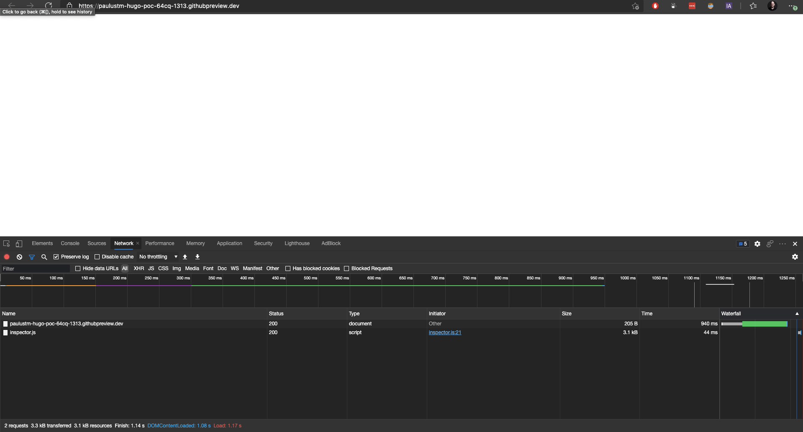
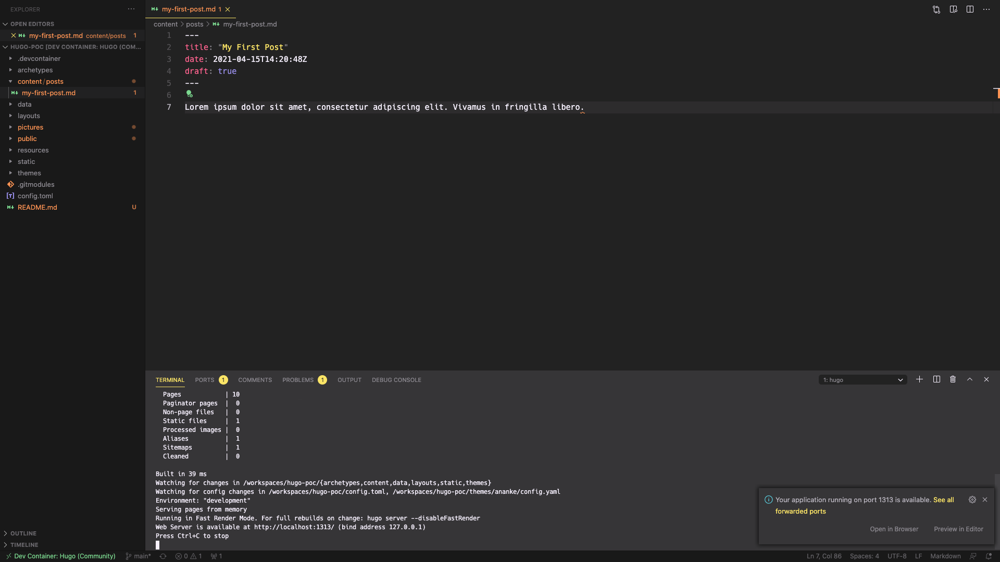
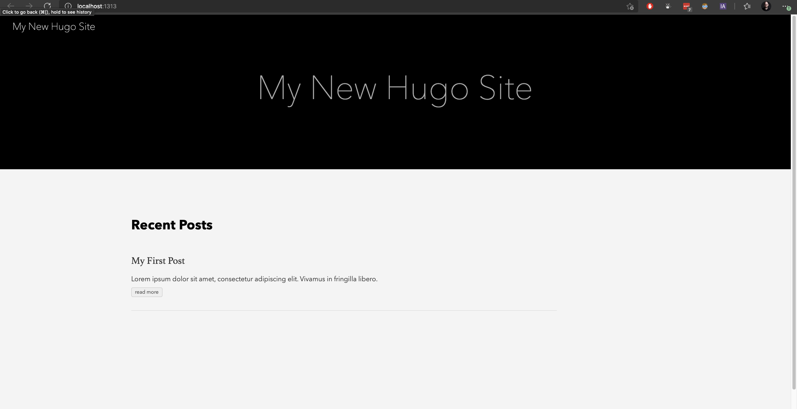

# HUGO and Codespaces issue

! Do not use this repo for any of you work, this is a debugging repo.

## The issue

Step 1. Opening this repo in codespaces

Step 2. Run the hugo server command from the console

`hugo serve -D --baseURL="https://paulustm-hugo-poc-64cq.github.dev/" --appendPort=false`

Step 3. Going to the port-forward page

`https://paulustm-hugo-poc-64cq-1313.githubpreview.dev/`

returns a blank page

## Local dev

Step 2. Run the hugo server command from the console

`hugo serve -D`

Step 3. Going to the port-forward page

`http://localhost:1313`

